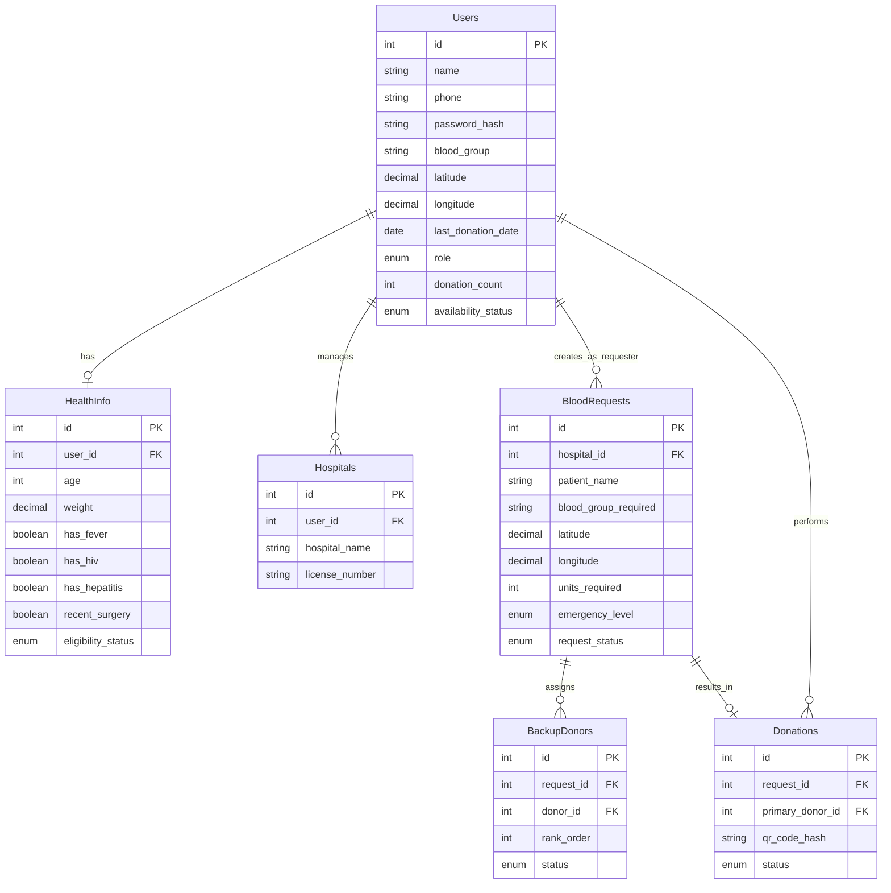

# Entity-Relationship Diagram

```mermaid
erDiagram
    Users {
        int id PK
        string name
        string phone
        string password_hash
        string blood_group
        decimal latitude
        decimal longitude
        date last_donation_date
        enum role
        int donation_count
        enum availability_status
    }
    
    HealthInfo {
        int id PK
        int user_id FK
        int age
        decimal weight
        boolean has_fever
        boolean has_hiv
        boolean has_hepatitis
        boolean recent_surgery
        enum eligibility_status
    }
    
    Hospitals {
        int id PK
        int user_id FK
        string hospital_name
        string license_number
    }
    
    BloodRequests {
        int id PK
        int hospital_id FK
        string patient_name
        string blood_group_required
        decimal latitude
        decimal longitude
        int units_required
        enum emergency_level
        enum request_status
    }
    
    Donations {
        int id PK
        int request_id FK
        int primary_donor_id FK
        string qr_code_hash
        enum status
    }
    
    BackupDonors {
        int id PK
        int request_id FK
        int donor_id FK
        int rank_order
        enum status
    }
    
    Users ||--o| HealthInfo : has
    Users ||--o{ Hospitals : manages
    Users ||--o{ BloodRequests : creates_as_requester
    Users ||--o{ Donations : performs
    BloodRequests ||--o{ BackupDonors : assigns
    BloodRequests ||--o| Donations : results_in
```

## Role Notes
- `admin`: web admin dashboard user
- `donor`: mobile donor user
- `hospital`: mobile requester who applies for required blood
